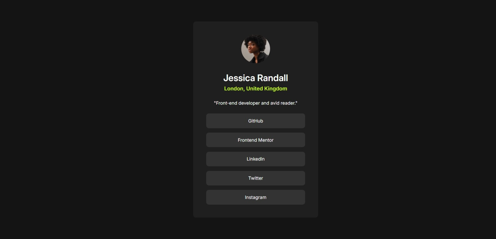

## Table of contents

  - [Screenshot](#screenshot)
  - [Links](#links)
- [My process](#my-process)
  - [Built with](#built-with)
  - [What I learned](#what-i-learned)
  - [Continued development](#continued-development)
- [Author](#author)

### Screenshot

### Links

- Solution URL: [Add solution URL here](https://your-solution-url.com)
- Live Site URL: [Add live site URL here](https://your-live-site-url.com)

## My process
When you review my first two projects, you can see that, like many beginner designers, I used fixed values for width and height. I made the same mistake at the beginning of this project as well. When I started designing for mobile and tablet, the structure of my project was breaking due to the fixed values I assigned. In this project, I learned to use percentage values instead of fixed values. This allowed me to easily adjust my layouts for responsive design while trying to use minimal code. In summary, I learned to use Grid, Flexbox, and percentages in this project.

### Built with

- Semantic HTML5 markup
- CSS custom properties
- Flexbox
- CSS Grid
- Mobile-first workflow

### What I learned
Grid, Flexbox

### Continued development
I want to create more polished designs with JavaScript.

## Author

- Frontend Mentor - [@volti42](https://www.frontendmentor.io/profile/yourusername)
- Twitter - [@JunHatchi](https://www.twitter.com/yourusername)
